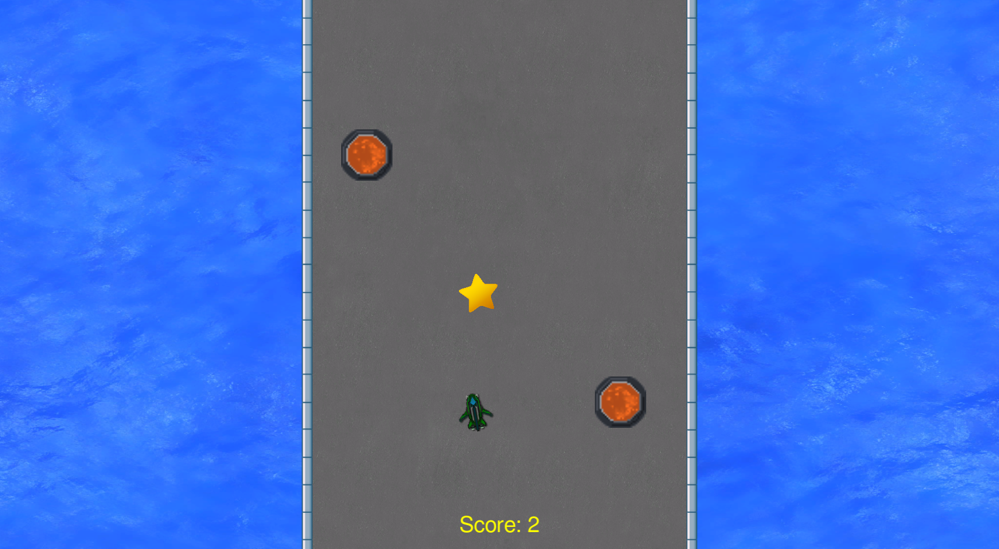
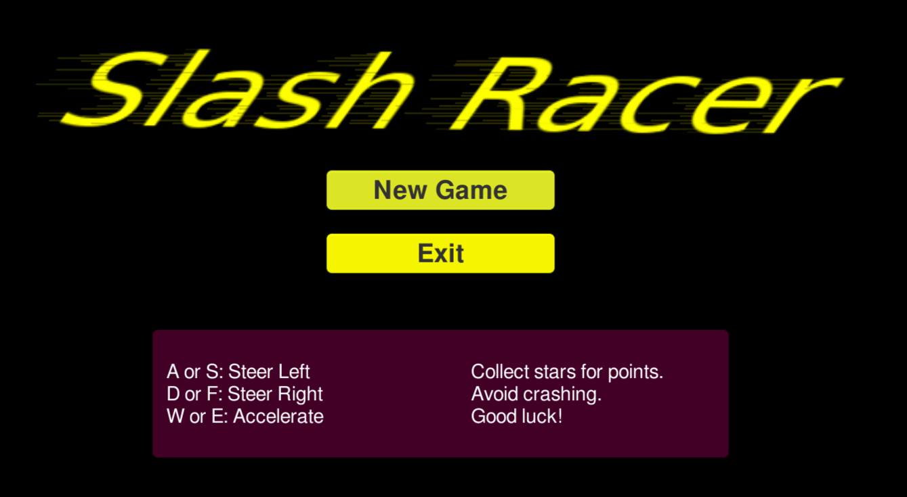

# Slash Racer

## Overview

Slash Racer is a vertical scrolling driving game. Players maneuver a vehicle on a track while collecting stars and avoiding obstacles.

This “One Game a Month” project features relatively simple gameplay. However, it is still significant due to being my first-ever Unity game. Additionally, this project has a bit of nostalgia for me, because a similar game was one of the first programs I ever wrote when I was first learning to code. The name is an homage to that version, which featured a track made up of slash characters.

## Download Now Available

Slash Racer is [available for download now](https://skleinjung.itch.io/slash-racer), with an optional donation to support my future work!

## Screenshots

